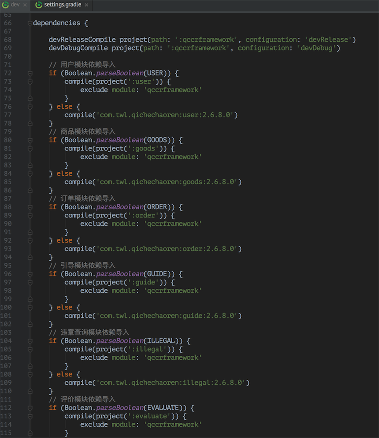
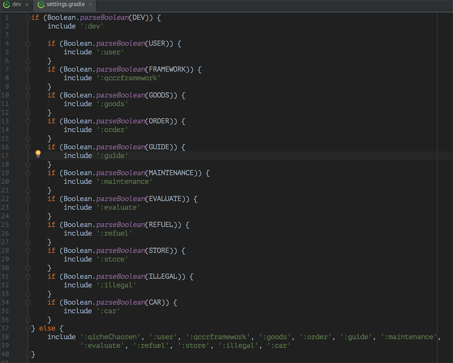

# 模块化加快构建速度

1. dev的模块导入

2. settings.gradle的配置

3. 在gradle.properties里配置需要开启的模块
~~~~
DEV=true
FRAMEWORK=true
USER=false
GOODS=false
ORDER=false
GUIDE=false
MAINTENANCE=true
EVALUATE=false
REFUEL=false
STORE=false
ILLEGAL=false
CAR=false
~~~~

